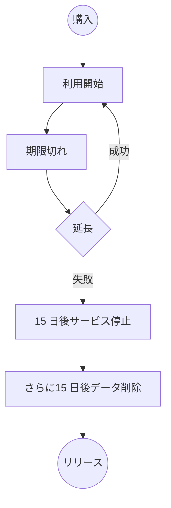
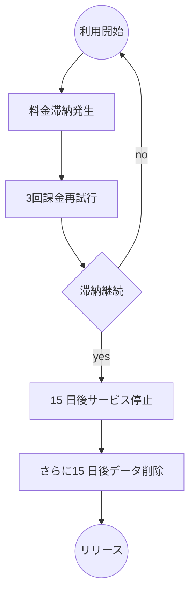

Tags ： AlibabaCloud Price Bill

---

本文の概要は下記のとおりです。

> * Alibaba Cloud 料金の基本的な考え方の紹介
> * Alibaba Cloud 課金体系の紹介
> * Alibaba Cloud お支払い関連の紹介
> * 代表的なプロダクトの料金体系の紹介

> ## 初めに

本文の目的は、[Alibaba Cloud](https://jp.alibabacloud.com) の課金ルールや料金計算方法などを紹介し、お客様のサービスにおける今後のコスト管理と最適化に役立つように、 AlibabaCloud の料金体系を理解してもらうことです。
![image_1dcghej001fom18mo10ug1c1c9cp2e.png-763.4kB][1]

> ## 基本概念

まず、買い物における一般的な料金関連の基本概念をいくつか紹介します。

### キーワード１：レンタル

一般的に、買い物は買った物に対する`所有権`の有無で２種類に分けられています。

- **所有権あり**：お金を払った後、物の所有権がお客様に移るケース。購入後のすべての権利をお客様が所有する。例：りんごを買った後、自分で食べるか、捨てるか、または他人にあげるか、どのように処分しても構いません。

- **所有権なし**：お金を払った後、物の所有権ではなく、一定期間内の`使用権`のみをお客様が所有するケース。例：ホテルの部屋に一週間泊まる場合、この一週間は部屋のものを使用する権利がありますが、破損してはいけません。また、一週間後にこの部屋から出なければなりません。

クラウド上の商品は、基本的にはお客様はデータセンターのリリース（CPU、DISK、NetWork）やアプリケーション（API）をある時間帯でレンタルし、自身のビジネスを行うという形です。なので、クラウド上料金の設定は基本的には`レンタル式`の考え方です。

### キーワード２：前払いと後払い

買い物の際、お金を支払うタイミングによって、課金方法は前払いと後払いの 2 種類に分けられています。

- **前払い**：`サブスクリプション`或いは`プリペイド`（Prepaid）という名前もよく使われています。支払いが行われた後にリソースを使用できます。これは一般的によく使用される支払い方法です。
- **後払い**：`従量課金`或いは`ポストペイド`（Postpaid）という名前もよく使われています。料金は実際の使用量に基づいて後で支払います。リソースはいつでも作成およびリリースできるため、とても柔軟性の高い支払い方法です。

2 つの課金方法は項目ごとにそれぞれメリットとデメリットがあります。比較の詳細は、下記表をご参照ください。

| 比較項目        | サブスクリプション  |  従量課金  |
| --------        | :-----:             | :----:     |
| 支払いタイミング| 前払い              |   後払い     |
| 決済サイクル    | 週／月／年          |  １時間  |
| 柔軟性          | 低                  |  高     |
| 平均単価        | 低                  |  高   |
| 利用シーン      | 長時間利用          |  短時間利用   |
| 料金滞納リスク  | なし                |  あり  |
| すぐリリース    | 不可                |  可能  |

Alibaba Cloud は`サブスクリプション`と`従量課金`の両方をサポートしています。

### キーワード３：ライフサイクル
前述の通り、クラウド上のプロダクトは基本的に`レンタル式`でサービスを販売しているため、一つのサービスを利用開始してから、利用できなくなる（リソースがリリースされる）までの期間を一つの`ライフサイクル`と言います。

ライフサイクルのステータス変化は支払い方式（サブスクリプションと従量課金）によって違います。サブスクリプションは購入したサービスの期限が切れるとリリースされますが、従量課金はお客様が手動でリリースしないかつ料金滞納が発生しない限り、サービスが自動的にリリースされることはありません。

イメージについて、下記フロー図をご参照ください。

- **サブスクリプション**のライフサイクル

- **従量課金**のライフサイクル

従量課金における料金滞納の影響範囲はアカウント内のすべての従量課金プロダクトです。

### キーワード４：課金計算単位

クラウドサービスの利用料金を計算する場合は、使用量と使用時間で下記項目と計算単位を明確する必要があります。

- 最小課金項目
- 利用量
- 最小利用量単位
- 最小利用量単位単価
- 利用時間（時間制の場合）
- 決済時間単位（時間制の場合）
- 時間単位単価（時間制の場合）

仮に、現在クラウドサービス ECS は 3 つの課金項目があります。

1.  インスタンス利用料金：一時間単位課金(10円／時間)
2.  クラウドディスク料金：ストレージごとに一時間単位課金(1.5 円／GB／時間)
3.  ダウンロードトラフィック料金：トラフィック量ごとに課金（0.5円／GB）

このインスタンスの利用時間が 3 時間、クラウドディスクの利用料が 40GB、ダウンロードしたデータ量が 120GB の場合、課金額を計算すると下記表のとおりになります。

| 課金項目　|　インスタンス|　クラウドディスク|　トラフィック|
| --------          | :-----:   | :----: | :----: |
| 利用量            | -     |  40GB  |  120GB |
| 最小利用量単位    | -     |  1GB   |  1GB   |
| 最小利用量単位単価| 10円  |  1.5円  |  0.5円|
| 利用時間          | 3時間 |  3時間  |  -    |
| 決済時間単位      | 1時間 |  1時間  |  -    |
| 時間単位単価      |  10円 |  1.5円  |  -    |
| **金額**          |  3*10円 |  40*3*1.5円 |  120*0.5円  |

料金に関する一般的な概念の紹介は以上になります。

次からは、具体的に課金項目の考え方や課金体系の詳細、支払いについてなどを紹介します。

> ## 課金項目

---

###  基本課金項目

Alibaba Cloud には、リソースの種類によって、`コンピューティング`、`ストレージ`、`ネットワークトラフィック`(アウトバウンドデータ転送)の 3 つの基本的なコスト要因があります。

- コンピューティング（Compute）
    * 基本的には`インスタンス`の費用を指します。インスタンスはスペック（CPU、メモリーサイズ）によって価格が異なります。
    * 一部サービスの API は Alibaba Cloud のコンピューティングリソースを利用しており、お客様独自のインスタンスを使用しないユーザー全体の共用サービスであるため、`API Call 回数`という単位で課金されることが多いです。

- ストレージ（Storage）
  ストレージの種類によって料金が異なります。基本的に GB 単位で一定期間内の使用料が徴収されます。

- ネットワークトラフィック（Network Traffic）

> ネットワーク料金について、データ転送 (アウトバウンド) は有料ですが、インバウンドデータ転送、または`同じリージョン`内の他の Alibaba Cloud サービス間でのデータ転送は無料です。

![image_1dfd51dcjduj1oahj4ns6v13n39.png-26.6kB][4]

これらの特性は使用している Alibaba Cloud 製品によって多少異なりますが、基本的にはこれらがコストのコア部分になります。それ以外は、各プロダクトの特徴次第で独自の課金項目が存在するものもあります。

###  プロダクト独自課金項目

インフラリソース（Compute、Storage、Network）以外は、プロダクトの特徴次第でいくつか課金される項目があります。例として、以下の項目があります。

- プロダクトのエンタープライズバージョン費（例：DataV、DNS）
- 工事費（例：ExpressConnect など工事が必要なプロダクト）
- SSL証明書（第三者提供サービス）

具体的には、各プロダクトの[料金紹介](https://jp.alibabacloud.com/pricing) ページをご参照ください。

> ## 課金体系

基本概念のセッションでも紹介しましたが、Alibaba Cloud は基本的に**サブスクリプション**と**従量課金**の二種類の課金方法を提供しています。プロダクトの従量課金と合わせてリソースパッケージ（例：トラフィックパッケージ）も提供されています。

![image_1dcjfs8se1cqt1jhktg1riqjgt9.png-52.3kB][5]

各課金方法の特徴について、具体的に紹介します。

### サブスクリプション
サブスクリプションは、支払った後にリソースを使用できる前払いの一種です。

- 基本オプション
 * アップグレードとダウングレード
 * サブスクリプションの延長（自動更新）
 * サブスクリプションの中止

※ プロダクトによって自動更新オプションとアップグレード／ダウングレードオプションは提供しない場合もあります。

- 料金と課金期間
サブスクリプションの平均料金は、従量課金よりも低くなります。リソースを大量に使用するユーザーには、ぴったりの料金プランです。料金プランは、基本的には`年間サブスクリプション`と`月額サブスクリプション`の 2 週類があります。
課金期間は、リソースが有効化された時刻から始まり、1 か月後または 1 年後の翌日の 00:00:00 に終了します。
>たとえば、2017 年 3 月 12 日 13:23:56 に月払いサブスクリプションモードで ECS インスタンスを有効化すると、インスタンスの最初の課金サイクルは 2017 年 4 月 13 日 00:00:00 に終了します。

- ライフサイクル管理（T+15+15 方針）
　有効期限切れのサブスクリプションインスタンスのステータスについて、関連リソースのステータス遷移は以下の表のとおりになります。

| 期限　     |　自動更新有効|
| --------   | :----: |
| 有効期限日当日(T)    |  正常に稼働  |
| 期限切れ15日後(T+15) |  サービス停止、データは保留   |
| 期限切れ30日後(T+30) |  リソースリリース、データ削除|

### 従量課金

従量課金では、実際に使用したリソース量に応じて料金が請求されます。 この方式により、随時要求に応じてリソースの有効化、リリース、購入が可能で、ビジネスの成長に合わせてスケールアップすることもできます。 多くのリソースが無駄になってしまうこともある従来のホストへの投資に比べ、30% から 80% 程コストを削減することができます。

- 決済サイクル
従量課金リソースは 1 秒ごとに課金されますが、決済は 1 時間ごとです。 以下の点にご注意ください。
 * 従量課金リソースの支払いは、使用後に、ご利用のアカウントで課金されている他のプロダクトと合わせて決済されます。
 * 通常、ご利用のアカウントの累積の月間消費額が １万円 未満の場合、翌月の初日に料金が差し引かれます。

- 課金項目
クラウド製品は、課金方式および製品自体の特性に従って、同じクラウド製品/サービスで複数の課金項目を定義することができます。クラウド製品に複数のサービスフォームの組み合わせがある場合は、複数の課金項目を定義する必要があります。
例：OSS サービスの課金項目
 * ストレージ料金
 * インターネットへのデータ転送料金
 * API リクエスト料金

- ライフサイクル管理（T+15+15 方針）
1 回の決済期間に従量課金のリソース料金の支払いに 3 回失敗した場合、関連するリソースのステータス変更はサブスクリプションと同じ、T+15日後でリソース停止、T+30でリソースリリースされ、データも削除されます。
例：従量課金 ECS インスタンスの決済処理は、以下のフローチャートのようになります。 支払期限を 3 月 1 日と仮定しています。
![image_1dfdekmhu1ikv1uihcnq122a1meim.png-46.2kB][6]

- インスタンス停止後の課金

> Alibaba Cloud では、従量課金のインスタンスが停止しても、リソースをリリースしない限り課金され続けます。

ECS には、停止したインスタンス（VPC 接続）には課金されない という機能が導入されています。この機能を有効にすると、停止済みステータスになったときに、VPC 接続の従量課金インスタンスに料金を支払う必要はありません。詳細は、[こちら](https://jp.alibabacloud.com/help/doc-detail/63353.htm) を参照ください。

### リソースパッケージ

リソースパッケージは従量課金の補足として使われています。一部リソース（例えばトラフィック）は事前に使用量を予測するのが難しいため、実際の使用量に応じた課金方法でしか対応できません。このようなリソースを Prepay でも使用できるように、リソースパッケージが作成されました。リソースパッケージを使用すると、リソースパッケージ内のリソース量が優先的に差し引かれます。超過した部分は従量課金で課金されます。
通常のサブスクリプションとリソースパッケージの比較について、下記をご参照ください。

| 比較項目　     |　サブスクリプション|　リソースパッケージ|
| --------   | :----: | :----: |
| 課金方式    |  Prepay  |Prepay  |
| 購買単位 |  時間単位(月／年)   |リソース単位（通常はGB）   |
| リソースタイプ |  Computing|  Storage, Outbound Traffic|
| 使い切る場合 |  リリースされる|  従量課金として課金される|

> ## 価格と割引

Alibaba Cloud の価格影響要因や無料利用枠など、お客様のコスト削減に役立つ内容を紹介します。

###  価格の影響要因
- リージョン
  - 基本的にはデータセンター所在国（地域）の場所によって、ハードウェアとネットワークのコストが違うため、クラウドプロダクトの料金も違います。
- スペック
 - インスタンスタイプによって、使ってるリソース（コンピューティング、ストーレッジ）が違います。従って、プロダクトを買う前に、お客様の業務ニーズに合わせたスペックをご選択ください。
- 利用量
　- 一部プロダクトのストーレッジとトラフィックは使用料が多くなるほど、単価料金が安くなります。
- バージョン
　- DNS、DataVなどプロダクトのバージョンによって機能が違うため、料金も大きく違います。

### 割引と無料利用枠

お客様が手軽に Alibaba Cloud の製品の利用を開始できるように、アカウントを登録すると、日本サイト全体に適用される無料クーポンが付与されます。

また、一部プロダクトでは個別に無料利用枠が用意されており、お客様のトライアル費用を抑えることができます。

- 無料トライアル
  * 無料範囲内で 40 以上の製品を最大 1 年間無料でお試しいただけます。簡単な手順でサインアップできます。
  * 30,000 円分のクーポンが利用可能です。
  * 各種サービスの購入時にクーポンを選択していない場合、もしくは付与されたクーポン金額以上ご利用の場合は、全額または差額について請求させていただきますのでご注意ください。
  * スターターパッケージの購入時にクーポンはご利用いただけません。
  * 従量課金をご利用の場合はクーポンの選択は不要です。自動的にクーポンが適用されます。
  * 詳細は、[こちら](https://jp.alibabacloud.com/campaign/coupon-freetrial) をご参照ください。
- プロダクト個別の無料利用枠
  * OSS、MaxComputeなどのプロダクトは、最初の何Gストーレッジ無料枠が持っています。具体的には各プロダクトの料金ページにご確認ください。
- Start package 割引
  * 期間限定の新人向け限定セールです。ECSを通常より安い値段でご購入いただけます。詳細について[オフィシャルサイト](https://www.alibabacloud.com/zh/starter-packages/general)の情報にご参照ください。
- 年間購入割引
  * 一部プロダクトは長い期間（１年間毎に）で購入する場合は、15％の割引があります。詳細について各プロダクトの購入ページにご確認ください。
 ![image_1dfvl19sb1iv8l3c1k1a57qfpp.png-6.4kB][7]

### 支払い関連

- 支払い方法
 - クレジットカードよりの支払い
 　個人でも法人でもクレジットカードのご利用が可能です。クレジットカードの制限について、[関連ドキュメント](https://jp.alibabacloud.com/help/doc-detail/50107.htm)にご参照ください。
 - NP掛け払い
  法人のみの利用は可能です。詳細について担当営業にお尋ねください。

> ## プロダクト別注意事項

料金の全体ルールに加えて、カテゴリーごとに Alibaba Cloud 基本プロダクトの料金を紹介します。製品および課金体系ごとの具体的な料金は、[Alibaba Cloud 料金表](https://jp.alibabacloud.com/pricing) でご覧いただけます。

### Compute
 * EIPの保持料金
   　- EIPの費用が２つ部分を含まれています。「EIP アドレス保持料」と「トラフィック料金」。
  　 -　EIPはECSとSLBにバインディングした場合は、EIP アドレス保持料が発生しません。それ以外の場合は「EIP アドレス保持料」が発生します。

---

  [1]: http://static.zybuluo.com/xkj1314/tbsxejtnbtjqpzlaq19et7xb/image_1dcghej001fom18mo10ug1c1c9cp2e.png
  [2]: http://static.zybuluo.com/xkj1314/k7m01v8umxd4wjp3ovmvo4io/image_1dcgh18uuttn1t90uos5v6ilj9.png
  [3]: http://static.zybuluo.com/xkj1314/8nkmd5qe8w45ag7mbhe7x24y/image_1dcgh6d6n8o8gl817ei157vcbb18.png
  [4]: https://xukejian.oss-ap-northeast-1.aliyuncs.com/%08mdpic/14_17_12__07_10_2019.jpg
  [5]: http://static.zybuluo.com/xkj1314/e2o2e3pf4e4v7emi1tl9b8ek/image_1dcjfs8se1cqt1jhktg1riqjgt9.png
  [6]: http://static.zybuluo.com/xkj1314/kuojm5wrg10a3xz4xuowm7k0/image_1dfdekmhu1ikv1uihcnq122a1meim.png
  [7]: http://static.zybuluo.com/xkj1314/l5j74a0i8to1wrsdujr9bb5u/image_1dfvl19sb1iv8l3c1k1a57qfpp.png
