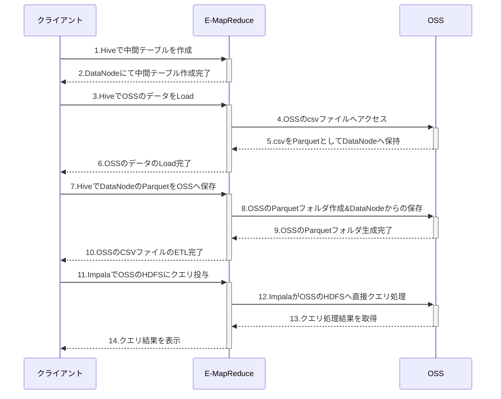

<!-- descriptionがコンテンツの前に表示されます -->

<!-- コンテンツを書くときはこの下に記載ください -->

## E-MapReduceの起動、チューリアトルについて
&nbsp; 簡単なチューリアトルとして、E-MapReduceを起動しHiveでOSSにあるCSVファイルをParquetへETLし、HiveでOLTP、ImpalaでOLAPというワークフローをしてみます。
E-MapReduceの起動は非常に簡単です。ゴールとしては以下の通りになります。

<br>

#### Step1: OSSにデータを保存します
BigDataを始めるためにはまずデータが必要です。今回はニューヨーク市のタクシーおよびリムジン委員会（NYC TLC）によるタクシーデータ（240GBを超えるCSVファイル）という[オープンデータ](https://www1.nyc.gov/site/tlc/about/tlc-trip-record-data.page)を使って、OSS+E-MapReduceを使用したETL、分析業務の取り込みについて説明します。
https://www1.nyc.gov/site/tlc/about/tlc-trip-record-data.page
<br>


<br>

ECSインスタンス１台にて、aliyun-cliをインストールします。そのあと、NYTデータをダウンロード、OSSヘアップロードします。
前提として、OSSにBigData専用のディレクトリを作成する必要があります。以下の例では
`oss://bigdata-prod-tech/nyc-taxi/yellow_tripdata/csv/` というディレクトリを作成しました。

以下はECS、CentOS 7.6での操作になります。
より詳しい[インストール方法はこちらを参考](https://www.alibabacloud.com/help/doc-detail/121541.htm)にしてください。
```bash
[root@aliyun ~]# 
[root@aliyun ~]# yum -y install wget
〜 略 〜
[root@aliyun ~]# wget https://aliyuncli.alicdn.com/aliyun-cli-linux-3.0.16-amd64.tgz
--2019-06-06 14:18:34--  https://aliyuncli.alicdn.com/aliyun-cli-linux-3.0.16-amd64.tgz
Resolving aliyuncli.alicdn.com (aliyuncli.alicdn.com)... 202.47.28.98, 202.47.28.99
Connecting to aliyuncli.alicdn.com (aliyuncli.alicdn.com)|202.47.28.98|:443... connected.
HTTP request sent, awaiting response... 200 OK
Length: 9159371 (8.7M) [application/x-compressed-tar]
Saving to: ‘aliyun-cli-linux-3.0.16-amd64.tgz’

100%[==============================================================================================================================================================>] 9,159,371   --.-K/s   in 0.06s   

2019-06-06 14:18:34 (150 MB/s) - ‘aliyun-cli-linux-3.0.16-amd64.tgz’ saved [9159371/9159371]

[root@aliyun ~]# tar -xzvf aliyun-cli-linux-3.0.16-amd64.tgz
aliyun
[root@aliyun ~]# 
[root@aliyun ~]# sudo cp aliyun /usr/local/bin
[root@aliyun ~]# 
[root@aliyun ~]# aliyun configure
Configuring profile '' in '' authenticate mode...
Access Key Id []: ＜ここは各自のAccess Key Idを入力してください＞
Access Key Secret []: ＜ここは各自のAccess Key Secretを入力してください＞
Default Region Id []: ap-northeast-1
Default Output Format [json]: json (Only support json))
Default Language [zh|en] en: en
Saving profile[] ...Done.
 available regions: 
  cn-qingdao
  cn-beijing
  cn-zhangjiakou
  cn-huhehaote
  cn-hangzhou
  cn-shanghai
  cn-shenzhen
  cn-hongkong
  ap-northeast-1
  ap-southeast-1
  ap-southeast-2
  ap-southeast-3
  ap-southeast-5
  ap-south-1
  us-east-1
  us-west-1
  eu-west-1
  me-east-1
  eu-central-1

Configure Done!!!
..............888888888888888888888 ........=8888888888888888888D=..............
...........88888888888888888888888 ..........D8888888888888888888888I...........
.........,8888888888888ZI: ...........................=Z88D8888888888D..........
.........+88888888 ..........................................88888888D..........
.........+88888888 .......Welcome to use Alibaba Cloud.......O8888888D..........
.........+88888888 ............. ************* ..............O8888888D..........
.........+88888888 .... Command Line Interface(Reloaded) ....O8888888D..........
.........+88888888...........................................88888888D..........
..........D888888888888DO+. ..........................?ND888888888888D..........
...........O8888888888888888888888...........D8888888888888888888888=...........
............ .:D8888888888888888888.........78888888888888888888O ..............
[root@aliyun ~]# 
[root@aliyun ~]# 
[root@aliyun ~]# aliyun oss ls
CreationTime                                 Region    StorageClass    BucketName
2019-05-27 13:59:58 +0800 CST    oss-ap-northeast-1        Standard    oss://bigdata-prod-tech
2019-02-26 09:47:16 +0800 CST        oss-cn-beijing        Standard    oss://ohiro18-analysis-china
2019-02-26 09:48:11 +0800 CST    oss-ap-northeast-1        Standard    oss://ohiro18-dev-japan
2019-04-01 11:51:37 +0800 CST    oss-ap-northeast-1        Standard    oss://ohiro18-mediation
2019-05-22 20:51:37 +0800 CST    oss-ap-northeast-1        Standard    oss://ohiro18-efk-ml
Bucket Number is: 5
0.335011(s) elapsed
[root@aliyun ~]# 
```
<br>

ECSでaliyun-cliのインストールが無事完了しましたので、今度はNYTデータをダウンロード、OSSへアップロードします。
```bash
[root@aliyun ~]# wget https://s3.amazonaws.com/nyc-tlc/trip+data/yellow_tripdata_2018-09.csv
[root@aliyun ~]# aliyun oss cp yellow_tripdata_2018-09.csv oss://bigdata-prod-tech/nyc-taxi/yellow_tripdata/csv/
[root@aliyun ~]# rm -rf yellow_tripdata_2018-09.csv
[root@aliyun ~]# wget https://s3.amazonaws.com/nyc-tlc/trip+data/yellow_tripdata_2018-10.csv
[root@aliyun ~]# aliyun oss cp yellow_tripdata_2018-10.csv oss://bigdata-prod-tech/nyc-taxi/yellow_tripdata/csv/
[root@aliyun ~]# rm -rf yellow_tripdata_2018-10.csv
[root@aliyun ~]# wget https://s3.amazonaws.com/nyc-tlc/trip+data/yellow_tripdata_2018-11.csv
[root@aliyun ~]# aliyun oss cp yellow_tripdata_2018-11.csv oss://bigdata-prod-tech/nyc-taxi/yellow_tripdata/csv/
[root@aliyun ~]# rm -rf yellow_tripdata_2018-11.csv
[root@aliyun ~]# wget https://s3.amazonaws.com/nyc-tlc/trip+data/yellow_tripdata_2018-12.csv
[root@aliyun ~]# aliyun oss cp yellow_tripdata_2018-12.csv oss://bigdata-prod-tech/nyc-taxi/yellow_tripdata/csv/
[root@aliyun ~]# rm -rf yellow_tripdata_2018-12.csv
```
<br>

この処理後、OSSのプレフィックス上では、このような感じになってると思います。


<br>


これで、OSSへのDataLake（厳密には違うが）、下準備が完了しました。
<br>


#### Step2: E-MapReduceを起動する前に、OSSでE-MapReduceに必要な権限を付与します。
&nbsp; E-MapReduceを起動する時に先に実施したいのがRAMロール **AliyunEmrEcsDefaultRole** の設定です。これを設定することで、EMRからOSSへのアクセスが楽になります。理由としては[こちらのBlog](https://www.sbcloud.co.jp/entry/2019/02/01/metaservice/)が参考になると思います。
https://www.sbcloud.co.jp/entry/2019/02/01/metaservice/
https://jp.alibabacloud.com/help/doc-detail/43966.html

```
{
  "Statement": [
    {
      "Action": [
        "sts:AssumeRole",
        "oss:GetObject",
        "oss:ListObjects",
        "oss:PutObject",
        "oss:DeleteObject",
        "oss:ListBuckets",
        "oss:AbortMultipartUpload"
      ],
      "Effect": "Allow",
      "Principal": {
        "Service": [
          "emr.aliyuncs.com"
        ]
      },
      "Resource": "*"
    }
  ],
  "Version": "1"
}
```
>初期設定状態


>E-MapReduceがOSSへアクセスできるように権限変更へ


<br>

#### Step3: E-MapReduceを起動します。
&nbsp; 本題、E-MapReduceを起動します。consoleからE-MapReduceを選定し、クラスタ作成を進めます。
今回、著者は以下の条件で起動いたしました。

###### 環境について
|Clustor|instance|Type|台数|
|---|---|---|---|
|Hadoop EMR-3.22.0|MASTER|ecs.sn2.large|1|
|       |CORE|ecs.sn2.large|4|
|       |TASK|ecs.sn2.large|4|


<br>
Masterインスタンス、Coreインスタンス、Taskインスタンスは任意での選定になります。
ただし、Hadoopエコシステムによっては必要な起動要件がありますので、状況によってはインスタンス台数を調整する必要があります。
役割はこちらを参考にしてください。
|種類|説明|役割|
|---|---|---|
|マスター|ジョブフロー全体の構成管理を実施|ジョブトラッカー、ネームノード|
|コア|HDFSを持っており、実際にデータを読み込みつつデータ処理を行う。一つのジョブフローに対して複数存在|タスクトラッカー、データノード|
|タスク|データは持たないが、MPPなどデータ処理のためにリソース提供することが可能。任意起動|タスクトラッカー|


<br>

knox（REST APIを使用してWebHDFSやHBaseとかWeb UIインターフェースを閲覧するもの）を利用する場合は、こちらにてKnoxユーザ追加のアカウントを登録するとあとが便利です。

<br>


途中、`ブートストラップアクション`という入力欄があります。ブートストラップアクションについて説明します。
E-MapReduceは上記の説明通り、ECSを起動し、E-MapReduceに必要な機能をインストール・起動、こうしてE-MapReduceを起動します。
この流れで注目したいのが `E-MapReduceに必要な機能をインストール・起動`という箇所で、これをブートストラップアクションと呼びます。
AlibabaCloudのE-MapReduceはブートストラップアクションが利用できるので、以下の例に加えて、様々な応用ができます。
* タイムゾーンの変更
* Igniteなど、利用したいOSSやライブラリをインストール

ここでちょっと例を記載してみます。E-MapReduceでタイムゾーンを変更したいとします。この場合、以下のshellを作成し、OSSへ格納します。
これをE-MapReduceのブートストラップアクション欄にてシェルを起動するように記載するだけです。
```bash
#!/bin/bash
sudo rm /etc/localtime 
sudo ln -s /usr/share/zoneinfo/Asia/Tokyo /etc/localtime
```
<br>

起動したい設定が終わったら、起動します。起動するエコシステムが多いほどブートストラップアクション含め時間がかかります（10〜30分）
<br>

E-MapReduceが無事起動完了したら、ヘルスチェックを見て無事完了してるかを確認します。自動でヘルスチェックが行ってることもあり、基本的には問題ないことが多いです。

<br>


#### Step4: E-MapReduceに関するセキュリティについて
&nbsp; E-MapReduceを起動しました。ここで上記の目的を達成するためにはHiveを使います。そのためにはHueというWebによるGUIインターフェース、もしくはCLIコマンドベースを使う必要があります。今回はHueというWebによるGUIインターフェースを使います。
Hueを使う前に、E-MapReduceのセキュリティルールを変更する必要があります。ここは用途に応じて対応をしてください。

###### 自分が使用してるNW環境のIPアドレスのみを許容する場合
[以下のサイト](http://www.ip138.com)へアクセスし、自分が使用してるNW環境のIPアドレスを取得します。これをE-MapReduceが使用してるセキュリティグループにてポート8443、8888に許容します。
http://www.ip138.com

E-MapReduceでのポート8443、8888、8088は次のような位置付けです。
|ポート|用途|
|---|---|
|knox|8443|
|Hue|8888|
|YARNリソースマネージャ|8088|


<br>

###### ローカルポートフォワードで接続
クライアント端末からE-MapReduceの環境へ接続するためには、sshポートフォワードを経由してアクセスしたい、という場合に使う方法です。

E-MapReduceのMasterNodeのプライベートIPを把握の上、Macローカルのターミナルにて以下コマンドでssh接続します。
```bash
ssh -fN -L 8888:<MasterNodeのプライベートIP>:8888 hadoop@<MasterNodeのプライベートIP>
```
|ssh引数オプション|意味|
|---|---|
|-f|コマンドを実行する際にsshをバックグラウンドにする|
|-fN|リモートでコマンドを実行しない|
|-L|クライアント→ホストのポート転送の際のアドレス・ポートを指定|
<br>
他の使い方もありますので、参考にいただければ幸いです。
https://jp.alibabacloud.com/help/doc-detail/28187.html
<br>


#### Step5: HueらWeb UIに接続
上記設定が終わり次第、Hueのアクセスリンクから閲覧したいURLを選択します。

<br>

今回はHue起動なのでHueを起動します。

<br>

ここでユーザ名、パスワードが求められます。ここはE-MapReduceのHue画面の設定にあるPWを取得して、
ユーザ名：admin
パスワード：<Hue画面の設定にあるPW>
を入力します。

<br>

これでHue Web UIが表示されました。

<br>

Hueの便利なところは「クエリ」のボタンから様々なHiveやImpala、Sparkなど様々なOSSのクエリを選択できることです。

<br>


#### Step6: Hueを使ってETL処理
続いて、E-MapReduceのHiveを使ってOSSにあるCSVファイルをHDFS_Parquetへ変換します。流れとして以下シーケンス図通りになります。


<br>

まずは 1〜2:「Hiveで中間テーブルを作成」の処理をします。HueでクエリをHiveに選択し、以下クエリを投げます。
このSQLはHiveで一時的に中間テーブル（クラスタ内のデータノード）を作成するものです。

```SQL
CREATE EXTERNAL TABLE `default.yellow_trips`( 
`vendor_id` string, 
`pickup_datetime` timestamp, 
`dropoff_datetime` timestamp, 
`passenger_count` float, 
`trip_distance` string, 
`pickup_longitude` float,
`pickup_latitude` float,
`rate_code` float )
 PARTITIONED BY (`yyyymmdd` string)
 ROW FORMAT DELIMITED 
 FIELDS TERMINATED BY ',' 
 ESCAPED BY '' 
 LINES TERMINATED BY '\n' 
 TBLPROPERTIES ("skip.header.line.count"="1");
```
<br>
HueでSQL入力画面に上記のSQLクエリを入力後、実行ボタンをクリックすればSQLが実行されます。


<br>


続いて、3-6:「HiveでOSSのデータをLoad」の処理をします。
Hiveのデータノードにて中間テーブル作成後、OSSのファイルを指定し、中間テーブルへLoadします（時間がかかります）
Load後 OSSのファイルは自動消去されますので、注意してください。
```SQL
LOAD DATA INPATH 'oss://bigdata-prod-tech/nyc-taxi/yellow_tripdata/csv/yellow_tripdata_2009-08.csv'　INTO TABLE default.yellow_trips partition (yyyymmdd='200908');
LOAD DATA INPATH 'oss://bigdata-prod-tech/nyc-taxi/yellow_tripdata/csv/yellow_tripdata_2009-09.csv'　INTO TABLE default.yellow_trips partition (yyyymmdd='200909');
LOAD DATA INPATH 'oss://bigdata-prod-tech/nyc-taxi/yellow_tripdata/csv/yellow_tripdata_2009-10.csv'　INTO TABLE default.yellow_trips partition (yyyymmdd='200910');
LOAD DATA INPATH 'oss://bigdata-prod-tech/nyc-taxi/yellow_tripdata/csv/yellow_tripdata_2009-11.csv'　INTO TABLE default.yellow_trips partition (yyyymmdd='200911');
LOAD DATA INPATH 'oss://bigdata-prod-tech/nyc-taxi/yellow_tripdata/csv/yellow_tripdata_2009-12.csv'　INTO TABLE default.yellow_trips partition (yyyymmdd='200912');
LOAD DATA INPATH 'oss://bigdata-prod-tech/nyc-taxi/yellow_tripdata/csv/yellow_tripdata_2010-01.csv'　INTO TABLE default.yellow_trips partition (yyyymmdd='201001');
LOAD DATA INPATH 'oss://bigdata-prod-tech/nyc-taxi/yellow_tripdata/csv/yellow_tripdata_2010-02.csv'　INTO TABLE default.yellow_trips partition (yyyymmdd='201002');
LOAD DATA INPATH 'oss://bigdata-prod-tech/nyc-taxi/yellow_tripdata/csv/yellow_tripdata_2010-03.csv'　INTO TABLE default.yellow_trips partition (yyyymmdd='201003');
LOAD DATA INPATH 'oss://bigdata-prod-tech/nyc-taxi/yellow_tripdata/csv/yellow_tripdata_2010-04.csv'　INTO TABLE default.yellow_trips partition (yyyymmdd='201004');
LOAD DATA INPATH 'oss://bigdata-prod-tech/nyc-taxi/yellow_tripdata/csv/yellow_tripdata_2010-05.csv'　INTO TABLE default.yellow_trips partition (yyyymmdd='201005');
LOAD DATA INPATH 'oss://bigdata-prod-tech/nyc-taxi/yellow_tripdata/csv/yellow_tripdata_2010-06.csv'　INTO TABLE default.yellow_trips partition (yyyymmdd='201006');
```
<br>
SQL実行したい量が多いので、コツとして実行したいSQKをマウスで全て選択し、実行ボタンを押すと順次SQL実行してくれます。


<br>


この処理の結果としてパーティションを確認します。ここでPartitionが表示されたらDataNode、中間テーブルにデータがあることがわかります。
```SQL
SHOW PARTITIONS default.yellow_trips;
```

<br>

テストにHive SQLを中間テーブルに投げてみます。ここでも結果が表示されていたらOKです。
>注意として、レコード数が多いため、limit などでレコード表示件数を制限してください。
```SQL
SELECT vendor_id,pickup_datetime,passenger_count FROM default.yellow_trips WHERE yyyymmdd >= '201003' AND yyyymmdd <= '201004' limit 10;
```

<br>


7-10:「HiveでDataNodeのParquetをOSSへ保存」の処理をします。DataNodeにある中間テーブルをOSSへ保存するために、OSSでParquet形式で保存したいテーブルを作成します。

```SQL
CREATE EXTERNAL TABLE yellow_trips_parquet (
`vendor_id` string, 
`pickup_datetime` timestamp, 
`dropoff_datetime` timestamp, 
`passenger_count` float, 
`trip_distance` string, 
`pickup_longitude` float,
`pickup_latitude` float,
`rate_code` float)
PARTITIONED BY (`yyyymmdd` string)
STORED AS PARQUET
LOCATION 'oss://bigdata-prod-tech/nyc-taxi/yellow_tripdata/hive_parquet';
```
この結果として、上記の`oss://bigdata-prod-tech/nyc-taxi/yellow_tripdata/hive_parquet`にてフォルダが自動で作成されます。


<br>

続いて、DataNodeにある中間テーブルをOSSのParquetへ保存するSQLを実行します。
```SQL
set hive.exec.dynamic.partition.mode=nonstrict;
INSERT OVERWRITE TABLE yellow_trips_parquet PARTITION (yyyymmdd)
SELECT 
vendor_id,
pickup_datetime,
dropoff_datetime,
passenger_count,
trip_distance,
pickup_longitude,
pickup_latitude,
rate_code ,
yyyymmdd 
FROM yellow_trips where yyyymmdd='201004';
```
その結果、OSSのPartitionが yyyymmdd='201004' というところにHDFS_parquetファイルが生成されます。これでOSSにあったCSVファイルをHDFS_ParquetへETLすることができました。ちなみにDataNodeの中間データで Partitionが yyyymmdd='201004' はこのSQLクエリにより自動削除されています。

あとはPartitionごとに上記クエリを投与してETL処理をしていただければと思います。また、HiveはOLTP（加工処理）が得意なので、ここでSQLを使ってレコードの追加、削除、更新をしてみるのもいいです。
<br>


11-14.「ImpalaでOSSのHDFSにクエリ投与」の処理をします。Hueの「クエリ」プルタウンでImpalaを選択します。
ImpalaでOSSにあるデータをHDFSとして認識するために以下SQLクエリを投与します。
```SQL
CREATE EXTERNAL TABLE yellow_trips_impala (
`vendor_id` string, 
`pickup_datetime` timestamp, 
`dropoff_datetime` timestamp, 
`passenger_count` float, 
`trip_distance` string, 
`pickup_longitude` float,
`pickup_latitude` float,
`rate_code` float)
PARTITIONED BY (`yyyymmdd` string)
STORED AS PARQUET
LOCATION 'oss://bigdata-prod-tech/nyc-taxi/yellow_tripdata/hive_parquet';

alter table default.yellow_trips_impala add partition(yyyymmdd='201004');
alter table default.yellow_trips_impala add partition(yyyymmdd='201005');
alter table default.yellow_trips_impala add partition(yyyymmdd='201006');
```
あとはImpalaでPartitionを指定しつつ、好きに分析することができます。
```SQL
SELECT vendor_id , pickup_datetime, dropoff_datetime, passenger_count 
FROM default.yellow_trips_impala 
WHERE yyyymmdd >= '201004' limit 10;
```


<br>

<br>

Impalaの優れてるところはSQLクエリにてLOCATIONをOSSのパス先を指定するだけで、クエリを投げることができます。
※もちろんSparkやHive、PrestoもOSSをセントラルストレージとしたSQLクエリ投与もできます。
<br>


## まとめ
本章ではE-MapReduceだけでOSSのcsvファイルをParquetへ簡単にETLできることや、OSSをセントラルストレージとしたOLTP、OLAP運用する手法を説明しました。
AlibabaCloudのE-MapReduceはこの流れをタイムスケジューラによって自動処理化することも可能ですし、そこから機械学習をすることも可能です。ビジネスシーンに応じた様々な応用ができます。
そのため、ファーストステップとして、上記E-MapReduceの全体的な流れを掴めればと思います。
<br>

## 余談
AlibabaCloud公式blogにもE-MapReduce起動方法、手法、ベストプラクティスが記載されていますので、こちらも参考にしてください。
[EMRクラスター管理](https://www.alibabacloud.com/blog/diving-into-big-data-emr-cluster-management_595321)

<br>


